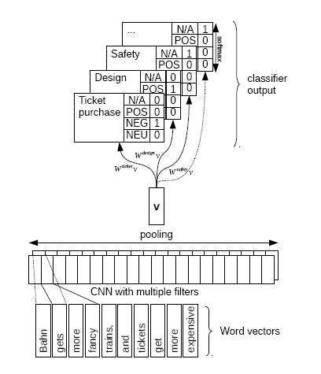

# Fine_Grained_Sentiment_Of_Chinese
AI Challenger Fine Grained Sentiment channel 

testA, testB 都是F1为0.689

基于 [Joint Aspect and Polarity Classification for Aspect-based Sentiment](https://arxiv.org/abs/1808.09238, "paper") 作为baseline

重点也就是中间的特征提取层，我倾向于使用**端到端**的学习方式，让模型自己去学习特征。
中间的特征提取层我尝试很多模型：
- CNN
- GRU
- Bi-GRU
- LSTM
- Bi-LSTM
- CNN-RNN
- Attention-LSTM(hierarchical_attention, bi_attention)
...

具体模型代码在.works/train/work_fine_grained_sentiment/model下
在尝试多种模型后，效果最好的是**Attention-LSTM(hi_attention)**

后续也使用了Google 的BERT 做了fine-tuning 初步试了把，效果才testA 才0.66 调调后再传上来

